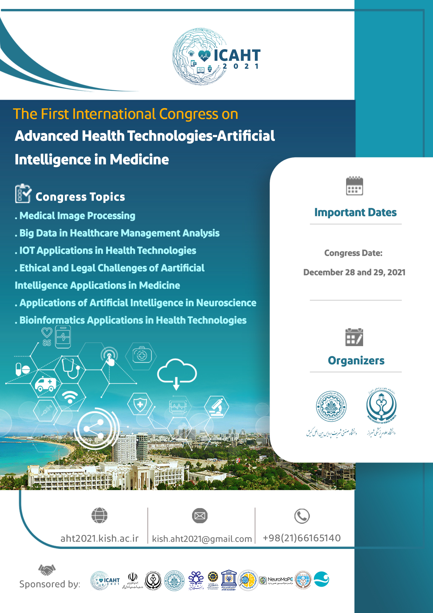

# Deep-Learning-Workshop
 Files presented in ICAHT workshop ...

ICAHT is the first international congress on
'Advanced Health Technologies-Artificial Intelligence in Medicine'

In this congress I was instructor in deeplearning workshop.

## Topics
* Multi layer perceptron (MLP) \
	A regresion model for sin function \
	classificaiton of MNIST dataset (a study on benefits of regularization terms 'Dropout' and 'Batchnormalization')
* Convolutional Neural Networks (CNNs) \ 
	classificaiton of MNIST dataset (comparison with MLP models)\
	Unet implementation for DRIVE dataset segmentation
* Variational Auto Encoders (VAE) \ 
	Generate MNIST dataset images with VAE
* Generative Adversarial Networks (GANs) \ 
	Generate MNIST dataset images with GAN

All the codes were implemented with Tensorflow 2 and Keras.

